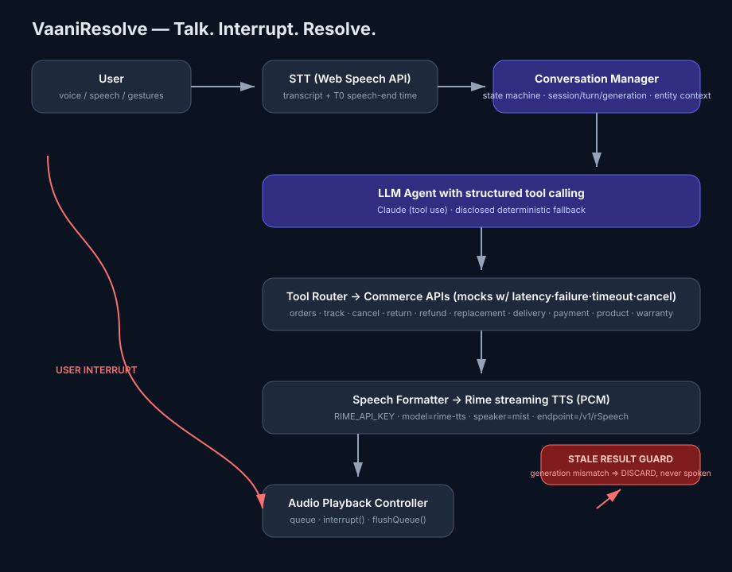

# VaaniResolve

**Talk. Interrupt. Resolve.**

VaaniResolve is a **voice-native AI customer-support / resolution agent** for commerce platforms (Flipkart/Amazon-like). It handles order tracking, lookup, cancellation, returns, refunds, replacements, delivery issues, payment status, product information, warranty and general support — and it is **not** “a chatbot with a microphone”.



---

## 1. Problem

Traditional support bots make you **wait** — the AI listens, thinks, calls a slow order API, then replies. If you realize you asked about the *wrong thing mid-thought*, you cannot do anything until it finishes. You repeat context, you hear answers about the wrong order, and frustrated users hang up.

## 2. Solution

VaaniResolve keeps **listening while it works**. The moment you speak again, it **stops the current Rime speech, flushes queued audio, bumps the conversation generation, aborts/invalidates the previous work, and answers the corrected request** — while **never speaking a stale result**.

## 3. USP

> **“The commerce support AI that can listen while it works.”**

The hard voice problem we solve is **interruption + context continuity during tool execution**.

Example that actually works in this repo:

1. “Where is my laptop?” → the slow order API starts (deliberately delayed 3–5 s).
2. “Wait, I mean my blue headphones.” → Rime stops instantly.
3. Generation increments. The laptop lookup, when it finally returns, is **rejected as stale**.
4. Only the **headphone** result is spoken, with context preserved.

## 4. Why voice is essential

Commerce support is inherently conversational and iterative: tracking → clarifying → acting. Voice is the fastest natural interface, and the ability to **barge in and correct** is exactly what makes voice usable over a phone-like channel. Any button-only UI cannot interrupt a spoken answer mid-utterance; VaaniResolve’s interruption engine is the point of the product, not a bolt-on.

## 5. Architecture

```
User
  ↓  voice → Web Speech STT
Conversation Manager (explicit state machine + generation)   ← the source of truth
  ↓
LLM/Agent (tool calling)  [Claude, or disclosed deterministic agent]
  ↓
Tool Router → commerce mock APIs (realistic latency/failure/timeout/cancel)
  ↓
Speech Formatter (concise, spoken-language)
  ↓
Rime streaming TTS (primary)  [disclosed fallback for resilience only]
  ↓
Audio Playback Controller (queue + interrupt)
  ↓  Web Audio → speaker
User

Interruption path:
 User speaks again / presses stop
   → InterruptController → stop Rime + flush audio
   → abort/invalidate old work
   → generation++ → process new turn
   → validate result against current generation
   → stale? → DISCARD (STALE_RESULT_DISCARDED) → never spoken
```

## 6. Features

- **Voice-first** push-to-talk and continuous listening
- **Interrupt by speaking** — barge-in works during speech *and* during tool execution
- **Explicit conversation state machine** (IDLE…RESOLVED/ERROR) with session/turn/generation/requestId on every async operation
- **Stale-result protection** at LLM, tool, speech-generation and playback-queue layers
- **Destructive-action confirmation** (cancel/return/replacement) that can itself be cancelled mid-confirmation
- **Context continuity** — “When will it arrive?” / “Cancel them.” / “Actually don't.”
- **Rime** as primary TTS; disclosed fallback only for resilience
- **Premium responsive UI**: waveform, transcript/captions, state indicators, tool progress, order/product/resolution cards, stop/interrupt, confirmation UI, developer panel
- **Observability**: session/turn/generation, intent, tool + latency, STT/LLM/Rime/TTFA latencies, interrupt/stale counters, structured event log
- **Demo mode** (normal / interrupt / stale / confirmation / refund) that triggers **real** turns
- **Deterministic stress test + automated tests** across all packages
- **Evaluation harness** writing real measurements to `evaluation/results/`

## 7. Tech stack

| Layer | Choice |
|---|---|
| Frontend | React 18 + TypeScript + Vite + Tailwind CSS |
| Backend | Node.js + TypeScript + Express + `ws` (WebSocket) |
| Realtime | WebSocket (`/ws`), binary-safe PCM relay |
| LLM | Anthropic Claude via `@anthropic-ai/sdk` (structured tool calling); disclosed deterministic fallback |
| STT | Browser Web Speech API (`webkitSpeechRecognition`) |
| TTS | **Rime** streaming rSpeech (PCM); disclosed fallback synthesizer |
| Data | Synthetic in-memory dataset (mock commerce APIs with latency/failure/timeout/cancel) |
| Tests | `node:test` across packages + deterministic stress test |

## 8. Installation

Requires **Node 20+**.

```bash
npm install
cp .env.example .env   # add RIME_API_KEY (and optionally ANTHROPIC_API_KEY)
npm run dev            # server :8787 + web :5173
```

If no API keys are set, the product still runs end-to-end: the **disclosed deterministic agent** drives real tool execution and the **disclosed fallback TTS** keeps audio audible. The developer panel always states which provider is active.

## 9. Environment variables

See [.env.example](.env.example). Key entries:

| Variable | Purpose |
|---|---|
| `RIME_API_KEY` | Rime auth (primary TTS). Never committed. |
| `RIME_MODEL` | Rime model (`rime-tts`) |
| `RIME_SPEAKER` | Rime speaker (`astra` — validated en voice; others: `ember` `cove` `luna` `river`) |
| `RIME_LANGUAGE` | language (`en`) |
| `RIME_ENDPOINT` | streaming endpoint (`https://users.rime.ai/v1/rSpeech`) |
| `RIME_SAMPLE_RATE` | PCM sample rate (`24000`) |
| `ANTHROPIC_API_KEY` / `ANTHROPIC_MODEL` | LLM agent (optional) |
| `PORT` | server port |
| `TOOL_LATENCY` / `TOOL_FAIL` / `STRESS_LAPTOP_MS` | deterministic tool behaviour for demo/stress |

## 10. Rime configuration (actually exercised)

Streaming HTTP POST to `RIME_ENDPOINT` (`https://users.rime.ai/v1/rSpeech`) with `Authorization: Bearer $RIME_API_KEY`, `Accept: text/event-stream`, and (Rime's documented schema — `sampling_rate`; rSpeech returns raw PCM at that rate):

```json
{ "model": "rime-tts", "speaker": "astra", "lang": "en",
  "text": "<spoken sentence>", "stream": true,
  "sampling_rate": 24000 }
```

Audio arrives as SSE `data:` chunks (`{"type":"audio","data":"<base64 PCM s16le>"}`), decoded client-side to Float32 and played through Web Audio. The parser is tolerant to protocol variants (JSON chunks, bare base64 lines, `data:`-prefixed or bare `[DONE]`, CRLF) so a Rime API change won’t break callers. See `packages/rime`.

## 11. Run instructions

```bash
npm run dev          # both apps (concurrently)
# or individually
npm run dev:server   # http://localhost:8787
npm run dev:web      # http://localhost:5173
```

Open `http://localhost:5173` in Chrome/Edge. Allow microphone. Click and hold the mic (or enable continuous listening). Speak.

## 12. Demo instructions

Click a **DEMO MODE** chip in the UI (real turns through the live session), or run the CLI evidence runner:

```bash
npm run demo            # all modes, prints PASS/FAIL + real timings
npm run demo -- interrupt  # single mode
npm run eval -- 3       # 3-sample measured evaluation → evaluation/results
npm test                # full suite incl. deterministic stress test
```

## 13. Evaluation

Real, measured latencies are recorded to `evaluation/results/*.json` and surfaced in the developer panel:
`T0` speech end → `T1` STT → `T2` LLM → `T3` Rime request → `T4` first Rime audio → `T5` audible playback. `TTFA = T5 − T0`. Also tracked: interruption-to-audio-stop, tool latency, stale-result rejection, correction success and failure rate. No fabricated numbers.

## 14. Limitations

- STT is browser Web Speech (Chrome/Edge) — not server-side in this build.
- Mock commerce data is synthetic; tools are realistic but not live Flipkart/Amazon.
- Without `RIME_API_KEY`, the disclosed fallback tone stands in so the pipeline stays audible; Rime is the primary provider when configured.
- Deterministic agent drives real tools when no `ANTHROPIC_API_KEY`; with a key, Claude does structured tool calling.
- One ConversationEngine per connection; no multi-user session store or auth (hackathon scope).

## 15. Security

- No API keys in source; `.env` is git-ignored; `.env.example` only.
- Synthetic customer data only.
- Tool arguments are validated against a whitelist schema; no arbitrary tool execution.
- Server secrets never reach the browser (only runtime config labels).
- Run `npm run scan:secrets` before committing.

## 16. Third-party services

- **Rime** — TTS. Term-of-use apply to the key holder.
- **Anthropic** — LLM (optional).
- **Google Web Speech API** — browser STT (local transcript only).
- Everything else is first-party or permissively licensed (see [LICENSES.md](LICENSES.md)).

## 17. AI-assisted development disclosure

This project (including much of this README, the tests, and the docs) was authored with substantial assistance from Claude Code (Anthropic) acting as lead engineer under a detailed hackathon build brief. See [AI_DISCLOSURE.md](AI_DISCLOSURE.md).

## 18. Future scope

- WebRTC/LiveKit bidirectional audio for sub-100 ms true-realtime
- Server-side streaming STT (Deepgram/Whisper) replacing the browser recogniser
- Real commerce integrations (order APIs, webhooks, idempotency keys)
- Persistent session store (Postgres/Redis), auth, rate limiting
- Background Rime “outbound prompts” (hold music + re-prompt) while tools run
- Voice-cloned demo customers per order for a fully realistic demo